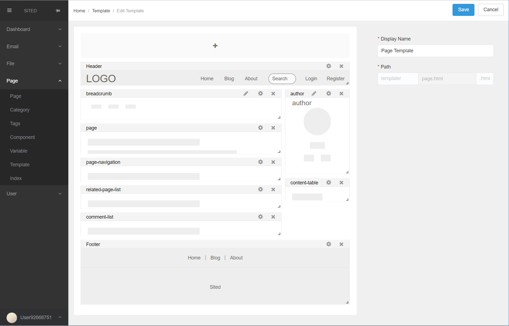
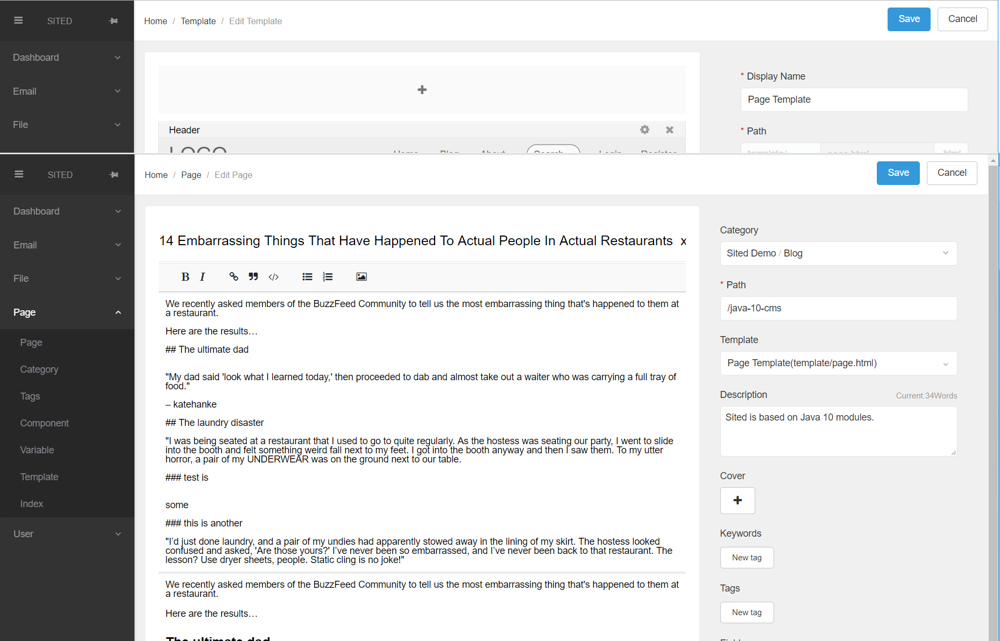
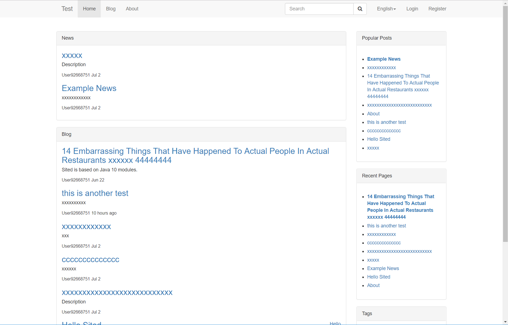
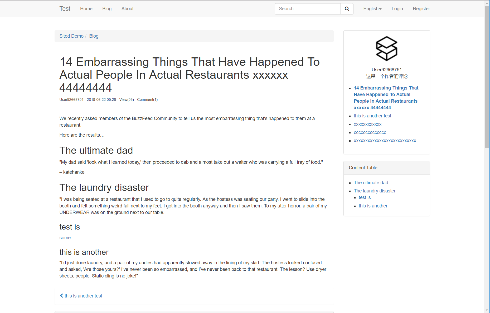

# Sited CMS

A developer friendly Java CMS based on JAX-RS, Guice style DI, Bean Validation, JPA and React. 

- **Built for startup, provides well designed quick prototyping code base.**
- **More modules are coming...**


[](http://) | [](http://) |
|:---:|:---:|
[Edit Template](doc/img/edit-template.png) | [Edit Page](doc/img/edit-page.png) |
| [](http://)  |  [](http://) |
| [Index Page](http://) | [Post Page](http://) |


## Online demo
TODO

## Features

Provides 

|***Frameworks***|***Content***|***Notes***|
|:---:|:---:|:---:|
|OS|Windows<br>Linux<br>Mac OS|
|Database|MySQL<br/>HSQL|**For other databases, need to manually install the JDBC driver**|
|Backend Console|React 16<br/>Element UI|Support IE11+|
|Frontend|jQuery 1.1.12<br/>Bootstrap 3.3.7|Support IE8+|
|API|Jersey<br/>Hibernate<br/>Hibernate Validator<br/> Jackson<br/>Guava<br/>DBCP<br/>||
|Messaging|RabbitMQ|Kafaka support is under development|
|Caching|Redis||
|Template Engine|Provides Thymeleaf like syntax<br>JEXL||
|***Modules***|||
|User|Login Page<br/>Register Page<br/>reset password <br/>support role<br/>permission management|Oauth support is under development|
|Page|Index Page<br/> Category Page<br/> Post Page<br/> Tag Page<br/> Archive Page<br/> Search result page|Support drag&drop widgets to edit template|
|Page Index|Index Pages with Lucene||
|File|File browser<br/>image scale<br/> file upload<br/> file download|Folder permissions similar to Linux file system is under development|
|Email|SMTP client<br/>SES client<br/>Email Template<br/>Email Tracking||
|Pincode|Email pincode||
|Captcha|Simple captcha image||


## Getting Started

These instructions will get you a copy of the Sited CMS up and running on your local machine.<br>

### Prerequisites

1. Download and install [Open JDK 10](http://jdk.java.net/10/) or [Oracle JDK 10](http://www.oracle.com/technetwork/java/javase/downloads/jdk10-downloads-4416644.html)
2. If you want to use MySQL as database. (***Optional, Sited default embeds HSQL***)
   1. Download and install [MySQL](https://dev.mysql.com/downloads/mysql/). 
   2. Create a database. <br>
   ```CREATE DATABASE main CHARACTER SET utf8mb4 COLLATE utf8mb4_unicode_ci;```
   3. Create a database user with schema update permission. <br>
   ```   CREATE USER 'user'@'localhost' IDENTIFIED BY 'password';   GRANT ALL PRIVILEGES ON * . * TO 'user'@'localhost';   FLUSH PRIVILEGES;   ```

### Installing

1. Download the package file [sited-0.9.zip](https://link) (***For all platform***)
2. Unzip the package
3. Run `./bin/sited`
4. Use a browser(IE11+) to open ```http://localhost:8080```
5. Fill in the require information to setup sited. 
   1. Choose language. 
   2. Input app name, the name will be displayed in page title. 
   3. Select database. 
      1. If you want to use MySQL, input the info of database and user you created.
   4. Input SMTP settings. 
      > Optional, if you skip the SMTP settings, user register will be disabled.
   5. Click install button. Sited will restart.
6. Open ```http://localhost:8080/admin/```


### Customize

The directory structure of sited

```
 sited
|-- bin
|   `-- sited
|-- conf
|   |-- messages
|   `-- app.yml
|-- lib
|   `-- jars...
|-- web
|-- file
|-- cache
`-- index
```

Sited use YAML syntax for configuration. Edit ***conf/app.yml*** to customize sited. 

##### app options


```
app:
  name: test
  language: en-US
  env: PROD
```


## Run Source Code

1. Clone the repo
2. Import as a Gradle project to Intellij IDEA or Eclipse.
3. Run sited-main/src/java/Main.java 

###Known issues

* There will be errors in module-info.java for duplicate module java.xml.bind
* There will be errors in DAO related source codes for missing @Transactional. 

It is because of Java 10 JEE split package issues. A temp fix for Intellij IDEA is: 
1. Open settings. Build, Execution, Deployment>Compiler>Java Compiler. 
2. Input the following parameters to Additional command line parameters. And replace the path of javax.transaction-api-1.3.jar. 
   ```
   --add-modules=java.xml.bind --patch-module java.transaction=~\.gradle\caches\modules-2\files-2.1\javax.transaction\javax.transaction-api\1.3\e006adf5cf3cca2181d16bd640ecb80148ec0fce\javax.transaction-api-1.3.jar
   ```
3. The error messages are still there, but it compiles. 

## Code Examples

To start an `App`: 

```
public class Main {
    public static void main(String[] args) throws InterruptedException {
        Path dir = Paths.get(System.getProperty("user.home")).resolve(".sited");
        App app = new UndertowApp(dir);
        ServiceLoader.load(AbstractModule.class).forEach(app::install);
        app.start();
    }
}
```

To create a `Module`:
```

public class TodoServiceModuleImpl extends TodoServiceModule {
    @Override
    protected void configure() {
        //import DatabaseModule to register entity and create repository
        module(DatabaseModule.class)
            .entity(Task.class);
        
        bind(TaskService.class);
        
        //register service implementation
        api().service(TaskWebService.class, TaskWebServiceImpl.class);
    }
}
```


## Release Notes

* What's next
  * Facebook integration
  * Add this sharing
  * GA tracking


* 0.9.0 · Beta release · [sited-0.9.zip](http://some)
  * User management, supports login/register/forget password/pincode/captcha code.
  * Page management, supports category/page/template/variable/components.
  * File management, supports upload files, download files, scale images, react file browser. 
  * Basic email template support

## Authors

* Chi (Xiamen, China)<br>
  If you need support for customization or commerce license, please feel free to contact me. 
    * email ```chiron.chi#gmail.com```
    * skype ```chiron.chi#gmail.com```
    * wechat ```sited-io```

See also the list of [contributors](https://github.com/your/project/contributors) who participated in this project.

## Contributing

Please read [CONTRIBUTING.md](https://gist.github.com/PurpleBooth/b24679402957c63ec426) for details on our code of conduct, and the process for submitting pull requests to us.


## License

This project is licensed under the AGPL License - see the [LICENSE.md](LICENSE.md) file for details


